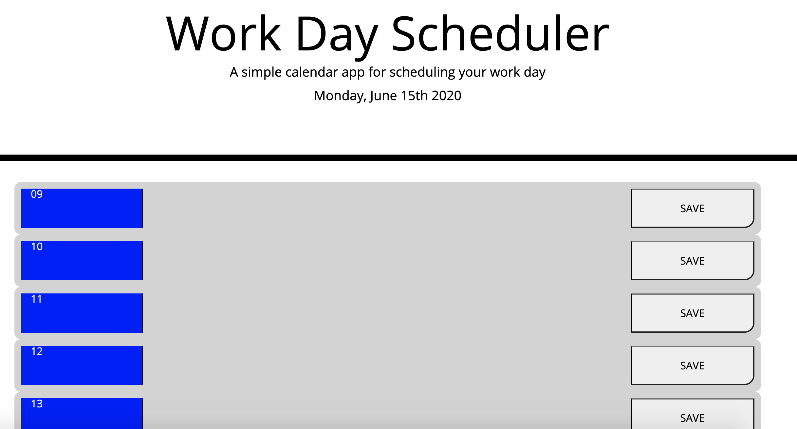

# Third-Party-API-Workday-Schedule
The workday scheduler is a jquery-powered, moment js supplemented, and bootstrap-gridded planner for daily scheduling. It displays the hours of a standard workday, and displays different colors to display hours that have past, the current hour, and future hours (red, green, and blue, respectively). In addition, when a scheduling event is added to an hour block, it is saved using local storage so the schedule can be referred to throughout the day. 

In the script you will find three functions. Firstly, a function to set the time to local time and create a for loop to make 8 separate timeblocks, each corresponding to an id that is equal to the military time of the timeblock. This function can then separate the past present and future timeblocks by checking if the id matches to the hour it is now.

The second function is simply a click function to save text to local storage, and the third function displays it back to the timeblock it was entered in so refreshing the page holds the scheduled event.

Repo Link: https://github.com/bendrakeacker/Third-Party-API-Workday-Schedule
Deployed Link: https://bendrakeacker.github.io/Third-Party-API-Workday-Schedule
